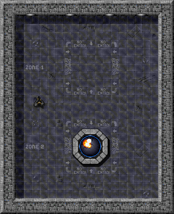

# Red Alert: Reactor Overheat!
**Reaktor, v ktorom nadmerne stúpne teplota, vie narobiť riadnu paseku.**

## Motivácia

Vitaj vo výcvikovom stredisku, kadet, kde z teba počas 12 týždňového tréningu spravíme ozajstného chlapa (rozumej _objektového programátora_)! O formu a podobu tvojho výcviku sa bude starať náš taktický a strategický tím, ktorý má s výcvikom kadetov tvojho formátu dlhoročné skúsenosti a rozhodne ťa nenechá vydýchnuť. Tvoj výcvik je totiž jeho prioritou.

Dnes to bude len zahrievacie kolo, v ktorom uvidíme, čo si zač, čo v tebe je a čo od teba teda môžeme očakávať. Aj keď sa jedná len o zahrievacie kolo, mnoho kadetov trhá tím a zostáva pri plnení dnešnej misie ešte niekoľko týždňov. Veríme, že ty partiu trhať nebudeš!

Z operačného strediska zdraví _Manager_.


## Ciele

- Naučiť sa vytvárať vlastné triedy, ich konštruktory a metódy.
- Naučiť sa _preťažiť_ implementáciu metódy pre rôzne typy parametrov.
- Naučiť sa reprezentovať stav objektu členskými premennými (zapuzdrenie údajov).
- Naučiť sa riadiť viditeľnosť členských premenných a metód.
- Naučiť sa vytvárať inštancie objektov z tried.


## Krok: Reactor Class

Tvojou úlohou je vytvoriť triedu, ktorá bude modelovať reaktor v prostredí hry _Alien Breed_. **Stav** takého reaktora bude reprezentovaný aktuálnou teplotou jeho jadra, celkovým poškodením reaktora a animáciou, ktorá aktuálny stav graficky vizualizuje. Postupne budeš do tejto triedy pridávať aj **správanie** reaktora pri jeho činnosti.


### Úloha
Vytvorte v projekte Java balík `sk.tuke.kpi.oop.game`.

Keďže projekt používa nástroj _Gradle_, je potrebné dodržať jeho [konvenciu na umiestňovanie Java zdrojových súborov](https://docs.gradle.org/current/userguide/java_plugin.html#sec:java_project_layout), a preto je potrebné vytvoriť tento balík v adresári `src/main/java`.


### Úloha
V balíku `sk.tuke.kpi.oop.game` vytvorte triedu `Reactor`, ktorá bude potomkom triedy `AbstractActor`.

Zápis, ktorý v jazyku Java hovorí o tom, že trieda `A` je potomkom triedy `B`, je nasledovný:

```java
class A extends B {
    // telo triedy
}
```

Trieda `AbstractActor`, ktorú použijete ako rodičovskú triedu novej triedy `Reactor`, predstavuje všeobecného _aktéra_ hry. Je súčasťou knižnice `GameLib`, ktorá je definovaná medzi závislosťami nášho projektu. Nie je preto potrebné ju vytvárať. Stačí ju _importovať_ do súboru vytvoreného pre triedu `Reactor`. V tomto vám ale dokáže pomôcť samotné vývojové prostredie po tom, čo napíšete názov triedy, ktorý kompilátor bez `import` príkazu nebude vedieť interpretovať.

> Vyučujúci:
> Pri zápise názvu rodičovskej triedy `AbstractActor` je vhodné ukázať, ako prostredie dokáže danú triedu importovať. Môžete predviesť aj funkcionalitu skratiek `Ctrl+Space` a `Alt+Enter`.

> Poznámka:
> Príkaz `import`, ktorý prostredie doplní, slúži len na skrátenie zápisu _plného_ mena triedy, ktorým je `sk.tuke.kpi.gamelib.framework.AbstractActor`. Po použití importu stačí v súbore používať krátke meno `AbstractActor`.

> Poznámka:
> Keď budete potrebovať importovať nejakú triedu z poskytnutej knižnice a prostredie vám ponúkne na výber z niekoľkých možných tried s rovnakým krátkym názvom, tú správnu možnosť identifikujete podľa prefixu balíka `sk.tuke.kpi.gamelib`.

```java
package sk.tuke.kpi.oop.game;

import sk.tuke.kpi.gamelib.framework.AbstractActor;

public class Reactor extends AbstractActor {
}
```


### Úloha
Do triedy `Reactor` pridajte členské premenné, ktoré budú reprezentovať stav reaktora: _aktuálnu teplotu_, _poškodenie_ a _animáciu_ reprezentujúcu reaktor.

Jedná sa o nasledovné členské premenné:

- `temperature` - aktuálna teplota reaktora, reprezentovaná celým číslom, pričom minimálna hodnota je _0_ stupňov.
- `damage` - poškodenie reaktora, percentuálna hodnota, reprezentovaná celým číslom v rozsahu od _0_ (nepoškodený) do _100_ (zničený).
- `normalAnimation` - objekt animácie, ktorá reprezentuje bezporuchový stav reaktora. Použijeme **typ** `Animation` reprezentovaný triedou [`Animation`][animation-docs] z balíka `sk.tuke.kpi.gamelib.graphics`.

Pri tvorbe členských premenných nezabúdajte na to, že nechceme, aby boli voľne viditeľné mimo triedu! Použite preto patričný modifikátor viditeľnosti.

> Poznámka:
> V počítačovej grafike (hlavne v súvislosti s 2D hrami) je možné sa veľmi často stretnúť s termínom _sprite_. [_Sprite_](http://en.wikipedia.org/wiki/Sprite_(computer_graphics)) je malý dvojrozmerný obrázok (alebo animácia), ktorý je integrovaný do väčšej scény. Efekt animácie často vzniká postupným zobrazením niekoľkých obrázkov (snímkov) na rovnakej pozícii.
>
> 
>
> 
>
> V hernej knižnici, ktorú používame, budeme pracovať s objektami typu [`Animation`][animation-docs], ktoré je možné rovnako použiť na jednoduché statické obrázky, ako aj na obrázky obsahujúce snímky animácie sprite-u.

```java
import sk.tuke.kpi.gamelib.graphics.Animation;

public class Reactor extends AbstractActor {
    private int temperature;
    private int damage;
    private Animation normalAnimation;
}
```


### Úloha
Vytvorte _bezparametrický_ konštruktor triedy `Reactor`, v ktorom novovytváranému objektu inicializujete premenné reprezentujúce jeho stav.

V rámci inicializácie objektu nastavte:

- animáciu, ktorá bude znázorňovať reaktor, na nasledujúci obrázok

    

- počiatočnú teplotu jadra reaktora na hodnotu _0_, a
- počiatočnú percentuálnu hodnotu poškodenia na hodnotu _0_.

Animácie sa nachádzajú v projekte v priečinku `src/main/resources/sprites/`. Pri nastavovaní cesty k animácii používajte relatívnu cestu, pričom za koreňový priečinok je považovaný `src/main/resources/`. Cesta k animácii reaktora preto bude vyzerať takto: `sprites/reactor_on.png`.

> Poznámka:
> Pri písaní ciest k súborom animácie môžete tiež využiť skratku `Ctrl+Space` na dopĺňanie názvov súborov a adresárov.

Pre nastavenie animácie využite nasledovný fragment kódu umiestnený v konštruktore triedy `Reactor`:

```java
// create animation object
normalAnimation = new Animation("sprites/reactor_on.png", 80, 80, 0.1f, Animation.PlayMode.LOOP_PINGPONG);
// set actor's animation to just created Animation object
setAnimation(normalAnimation);
```

> Poznámka:
> Dokumentáciu k jednotlivým triedam, ich konštruktorom a metódam môžete získať priamo v rámci vývojového prostredia umiestnením textového kurzora na meno požadovaného elementu a použitím skratky `Ctrl+Q`. Táto skratka je dostupná aj pri prechádzaní zoznamom možností ponuky automatického dopĺňania kódu (`Ctrl+Space`). Dokumentácia je tiež dostupná [na samostatnej stránke](http://kpi.pages.kpi.fei.tuke.sk/objektove-programovanie/gamelib "Gamelib dokumentácia").

```java
public Reactor() {
    this.temperature = 0;
    this.state = false;
    this.damage = 0;
    this.normalAnimation = new Animation(
        "sprites/reactor_on.png",
        80, 80,
        0.1F,
        Animation.PlayMode.LOOP_PINGPONG
    );
    setAnimation(this.normalAnimation);
}
```


### Úloha
Overte správnosť svojej implementácie vytvorením inštancie reaktora a jeho vložením do hernej scény.

Pokiaľ ste postupovali správne, po spustení projektu (`Shift+F10`) budete vedieť pomocou inšpektora vytvoriť inštanciu triedy `Reactor` a umiestniť ju do hry.


> Vyučujúci:
> V prípade, že sa niekomu nezobrazí trieda `Reactor` v diagrame tried v inšpektore, je potrebné overiť, či vytvorili triedu v správnom balíku a či dedí od triedy `AbstractActor`. Inšpektor je nastavený tak, že zobrazí len triedy z balíka `sk.tuke.kpi` (a v ňom vnorených balíkov), ktoré sú priamo alebo zdedene anotované anotáciou `Inspectable` (`AbstractActor` má túto anotáciu).


### Úloha
Vytvorte metódy `getTemperature()` a `getDamage()`, pomocou ktorých budete vedieť získať hodnotu aktuálnej teploty jadra a jeho poškodenia.

Tieto metódy poskytnú prístup na _čítanie_ hodnôt teploty a poškodenia. Samozrejme, ich viditeľnosť je potrebné nastaviť na `public`. Následne viete opäť skontrolovať ich funkcionalitu pomocou inšpektora.

> Poznámka:
> Všimnite si, že metóda na získanie hodnoty členskej premennej `temperature` sa volá `getTemperature()` a pre `damage` sa volá `getDamage()`. Takéto pomenovanie metód na získanie hodnôt premenných pridaním predpony `get` k názvu premennej je konvenčné a budeme ho často využívať. Výsledná metóda sa zvykne "hovorovo" nazývať aj _getter_.

```java
public int getTemperature() {
    return temperature;
}

public int getDamage() {
    return this.damage;
}
```


## Krok: Reactor (Over)Heating

Späť k reaktoru! Získať jeho stav už vieš, teraz sa pozrieme na to, ako jeho stav meniť.


### Úloha
Vytvorte metódu `increaseTemperature()`, pomocou ktorej bude možné zvýšiť aktuálnu teplotu jadra reaktora.

Táto metóda nebude vracať žiadnu hodnotu a bude mať jeden celočíselný parameter (pomenovaný napr. _increment_), ktorý bude reprezentovať hodnotu, o ktorú sa má aktuálna teplota jadra zvýšiť.

Pri implementovaní metódy však zohľadnite nasledovné skutočnosti:

- S nárastom teploty lineárne zvyšujte poškodenie reaktora. Reaktor sa začne kaziť _po prekročení_ teploty _2000_ stupňov a prestane byť funkčný _pri dosiahnutí_ _6000_ stupňov. Následné ochladenie reaktora ale nezníži úroveň poškodenia, ktoré už vysoká teplota spôsobila (to znamená, že po volaní tejto metódy nemôže byť hodnota poškodenia reaktora nižšia ako pred jej volaním). Pri výpočte úrovne poškodenia zaokrúhľujte desatinnú časť výsledku nadol.

    

    > Poznámka:
    > Znižovanie poškodenia reaktora bude možné jedine jeho opravou, ktorú budete riešiť nabudúce.

- Ak teplota po zvýšení prekročí hodnotu _4000_ stupňov, vzhľad reaktora bude od tohto momentu reprezentovaný nasledujúcou animáciou:

    

- Ak je poškodenie reaktora v intervale <_33%_, _66%_>, teplota rastie 1.5-násobne; ak prekročí hodnotu _66%_, teplota porastie dvojnásobne. V oboch prípadoch je zmena uvedená oproti pôvodnej hodnote parametra _increment_. Po výpočte novej hodnoty teploty výsledok zaokrúhlite vždy nahor na najbližšie celé číslo.

- Ak teplota po zvýšení dosiahne (alebo prekročí) hodnotu _6000_ stupňov, dôjde ku zničeniu reaktora (poškodenie reaktora dosiahne hodnotu _100%_). Zničený reaktor bude reprezentovaný nasledujúcou animáciou:

    

- Ak poškodenie reaktora dosiahlo hodnotu _100%_, akékoľvek ďalšie zvyšovanie teploty už nemá žiadny efekt.

> Poznámka:
> Je výhodné vytvoriť objekty animácií už pri inicializovaní objektu a ich hodnoty uložiť do ďalších členských premenných. Keďže reaktor sa môže nachádzať v niekoľkých stavoch (v našom prípade v troch - stav ok, prehriaty a zničený reaktor), animácie reprezentujúce tento stav sa budú meniť. Ak sa v priebehu hry zmení stav reaktora napr. 50x, znamená to, že pri každej zmene potrebujete načítavať inú animáciu zvlášť - spolu teda 50 načítaní súborov animácií. Ak si však všetky animácie načítate pri inicializácii objektu, načítate spolu iba 3 súbory animácií, ktoré sa už budú používať podľa potreby.

```java
public void increaseTemperature(int increment) {
    this.temperature = this.temperature + increment;

    // if reactor is broken already, do nothing
    if(this.damage == 100){
        return;
    }

    // update animation
    // set broken reactor, when temp is over 6000C
    if(this.temperature >= 6000){
        setAnimation(
            new Animation("sprites/reactor_broken.png",
                80, 80, 0.1f,
                Animation.PlayMode.LOOP_PINGPONG
            )
        );
    // set hot reactor, when temp is over 4000C
    }else if(this.temperature >= 4000){
        setAnimation(
            new Animation("sprites/reactor_hot.png",
                80, 80, 0.05f,
                Animation.PlayMode.LOOP_PINGPONG
            )
        );
    // otherwise use normal animation
    }else{
        setAnimation(normalAnimation);
    }

    // when temperature is above 2000 and below 6000, then damage increases
    if (this.temperature >= 2000) {
        // update damage
        if (this.temperature >= 6000) {
            this.damage = 100;
        } else {

            int damage = this.temperature / 40 - 50;

            // update when current damage is bigger than previous
            if (this.damage < damage) {
                this.damage = damage;
            }
        }

    }
}
```


### Úloha
Vytvorte metódu `decreaseTemperature()`, pomocou ktorej bude možné znížiť aktuálnu teplotu jadra reaktora.

Táto metóda nebude vracať žiadnu hodnotu a bude mať jeden celočíselný parameter (pomenovaný napr _decrement_), ktorý bude reprezentovať hodnotu, o ktorú sa má aktuálna teplota jadra znížiť. Pozor, zníženie teploty neznižuje poškodenie, ktoré vysoká teplota už spôsobila!

Pri implementovaní metódy zohľadnite nasledovné skutočnosti:

- Ak je poškodenie jadra aspoň _50%_, reálne znižovanie teploty bude len polovičné oproti hodnote parametra _decrement_.
- Ak je poškodenie jadra na úrovni _100%_, znižovanie teploty už nemá žiaden efekt.
- Ak teplota jadra pri ochladzovaní klesne na _4000_ stupňov alebo menej, zmeňte animáciu reprezentujúcu stav reaktora na [sprite-link:reactor_on].


### Úloha
Vytvorte metódu `updateAnimation()`, ktorá na základe aktuálnej teploty nastaví animáciu reaktora.

Pri pozornom pohľade na metódy `increaseTemperature()` a `decreaseTemperature()` si všimnete, že obe metódy riešia nastavenie správnej animácie reaktora v závislosti na jeho teplote. Takáto duplicita je však zbytočná a komplikuje prípadnú zmenu funkcionality. Preto _refaktorujte_ svoj kód tak, že túto spoločnú funkcionalitu oddelíte do samostatnej metódy `updateAnimation()`.


### Úloha
Upravte implementáciu metód `increaseTemperature()` a `decreaseTemperature()` tak, aby ste pre zmenu aktuálnej animácie využili práve vytvorenú metódu `updateAnimation()`.

Po refaktorizácii z predchádzajúcej úlohy nezabudnite zmeniť aj pôvodné metódy, kde sa extrahovaný kód nachádzal, aby vyžívali novú metódu.

> Poznámka:
> Metóda `updateAnimation()` reprezentuje len _implementačný detail_ a nie je potrebné (ba dokonca ani žiadúce) aby bola dostupná používateľom objektu reaktora. Skryte preto túto metódu vhodným modifikátorom viditeľnosti.


### Úloha
Pomocou _Inšpektora_ umiestnite objekt reaktora do mapy a otestujte správnosť svojej implementácie.




## Doplňujúce úlohy

> Úloha:
> Ošetrite prípad, kedy sa pri volaní metód `increaseTemperature()` a `decreaseTemperature()` použije záporný parameter.

Ak k takémuto volaniu dôjde, nevykonajte žiadnu zmenu teploty.


> Úloha:
> Upravte reaktor tak, aby rýchlosť pulzovania jeho animácie závisela od úrovne poškodenia.

Pri vyššom poškodení reaktora by trvanie jedného snímku animácie malo byť kratšie, pre dosiahnutie efektu rýchlejšieho pulzovania reaktora.


## Doplňujúce zdroje

- Java Tutoriál: [Základy jazyka](https://docs.oracle.com/javase/tutorial/java/nutsandbolts/index.html)
- Java Tutoriál: [Triedy](https://docs.oracle.com/javase/tutorial/java/javaOO/classes.html)
- Java Tutoriál: [Objekty](https://docs.oracle.com/javase/tutorial/java/javaOO/objects.html)
- Java Tutoriál: [Dedičnosť](http://docs.oracle.com/javase/tutorial/java/concepts/inheritance.html)


[animation-docs]: http://kpi.pages.kpi.fei.tuke.sk/objektove-programovanie/gamelib/javadoc/core/sk/tuke/kpi/gamelib/graphics/Animation.html
