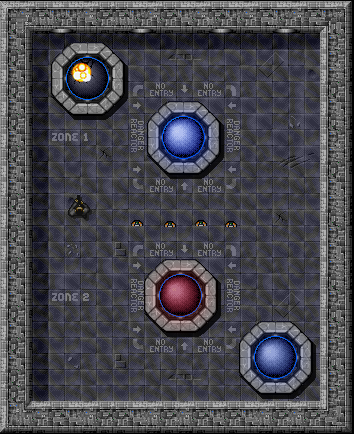
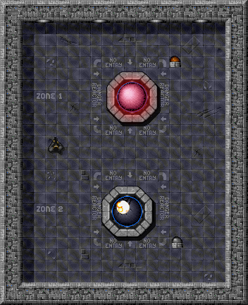

# Powering Devices
jeden reaktor dokáže napájať jedno svetlo... zatiaľ...


## Motivácia

Vitaj pri brífingu ďalšej misie, kadet! Úvodné zahrievacie kolo máš úspešne za sebou a spolu s našim taktickým a strategickým tímom predpokladáme, že si sa určite dostatočne zahrial pri ovládaní reaktora.

Pri plnení rôznych misií v teréne sa ti však určite hodí niekoľko zručností, ktoré získaš počas dnešného tréningu. Jedná sa hlavne o zručnosť používania referenčných typov ako parametrov metód. Táto nenápadná zručnosť už zachránila život nejednému objektovému programátorovi, preto ju nepodceňuj!

Veľa šťastia pri dosahovaní cieľov dnešnej misie! Z veliteľského mostíka zdraví _Manager_.


## Ciele

- Osvojiť si použitie kľúčového slova `this` vo vlastnom kóde.
- Osvojiť si tvorbu parametrických konštruktorov.
- Porozumieť využitiu referencie na objekt ako parametra metódy.


## Krok: First tools

Ako ste si všimli, pracovať s atómovým reaktorom nie je žiadna sranda. Hlavne keď sa začne prehrievať a neexistuje spôsob, ako ho opraviť... Hádam sa nájdu nejaké užitočné nástroje.


### Úloha
V balíku `sk.tuke.kpi.oop.game` vytvorte triedu `Hammer`, ktorá bude reprezentovať kladivo.

Animácia reprezentujúca kladivo na mape je uložená v súbore [sprite-link:hammer]. Obdobne, ako obrázok s animáciou reaktora, je aj obrázok kladiva dostupný vo vašom projekte. Kladivo bude mať členskú premennú pre počet zostávajúcich použití, ktorú inicializujte prostredníctvom konštruktora na hodnotu _1_. Premennej nastavte vhodnú viditeľnosť a prístup k nej zabezpečte patričnou `get` metódou.


> Poznámka:
> V prípade, že pri vytváraní animácie používate obrázok sprite-u, ktorý pozostáva len z jedného snímku animácie (tak, ako vyššie zobrazený sprite pre kladivo), môžete použiť konštruktor triedy `Animation` len s jedným parametrom - názvom obrázka:
> ```java
> new Animation("sprites/hammer.png");
> ```
> Rozmery animácie budú v takom prípade automaticky nastavené podľa rozmerov použitého obrázka.


### Úloha
Pridajte do triedy `Hammer` metódu `use()`, ktorá bude reprezentovať použitie kladiva.

Pri každom použití je potrebné aktualizovať počet zostávajúcich použití kladiva. Keď tento počet dosiahne _0_, kladivo odstráňte z hernej _scény_ (kladivo sa zlomilo).

> Poznámka:
> Každý _aktér_ zobrazený v hre sa nachádza v aktívnej hernej scéne, na ktorú má aj dostupnú referenciu. Scéna zas má možnosť _aktérov_ pridávať aj odoberať. Využite možnosti vývojového prostredia alebo si prezrite [gamelib-doc:Actor][dokumentáciu rozhrania `Actor`] a nájdite spôsob, ako získať referenciu na hernú scénu a ako pomocou nej odstrániť použité kladivo z hry.

> Vyučujúci:
> Diskutujte so študentmi o spôsobe riešenia tejto úlohy. Môžete im ukázať, ako si v prostredí nájdu metódy dostupné nad objektom. Dostaneme sa tu už aj k použitiu `this` ako parametra metódy.


## Krok: If all you have is a hammer, everything looks like a nail

V tomto kroku sa pokúsime poškodený reaktor včas opraviť vhodným nástrojom: kladivom.


### Úloha:
Vytvorte v triede `Reactor` metódu `repairWith()`, pomocou ktorej bude možné reaktor opraviť.

Metóda nebude vracať žiadnu hodnotu, ale bude mať jeden parameter typu `Hammer`. Jej správanie bude nasledovné:

- Metóda bude pracovať iba vtedy, ak hodnota parametra metódy obsahuje platnú referenciu na inštanciu triedy `Hammer` (a teda nie je `null`) a reaktor má hodnotu poškodenia vyššiu ako _0%_ ale ešte nie je úplne zničený.
- Použitie kladiva zníži poškodenie reaktora o _50_ percentuálnych bodov. Pozor ale na to, aby výsledná hodnota poškodenia neklesla pod _0_. Teda, ak bude reaktor poškodený, povedzme, na _92%_, po použití kladiva jeho poškodenie klesne na _42%_. A ak bude poškodený na _35%_, použitím kladiva sa úplne opraví (poškodenie _0%_).

> Poznámka:
> Keďže zvyšovaním teploty rastie poškodenie lineárne, po znížení poškodenia je potrebné odpovedajúcim spôsobom znížiť aj teplotu. K tejto časti úlohy sa vrátite neskôr v rámci doplňujúcich úloh.

> Poznámka:
> Pri implementácii nezabudnite na to, že okrem úrovne poškodenia a teploty je potrebné zmeniť aj obrázok, ktorý vizualizuje teplotu reaktora. Predíďte však duplikovaniu kódu!


### Úloha
Overte správnosť svojej implementácie.

Vytvorte na mape inštanciu reaktora a niekoľkých kladív. Následne reaktor prehrejte a pokúste sa ho opraviť použitím kladiva.


## Krok: Shutting Down Reactor

Výborne! Reaktor už zvládame opraviť, aj keď sa nadmieru prehreje (škoda, že v skutočnosti nestačí len to kladivo). Teraz by sa zišlo nájsť spôsob, ako reaktor v prípade potreby zastaviť alebo ho naopak naštartovať.

### Úloha
V triede reaktora vytvorte metódy `turnOn()` a `turnOff()`, pomocou ktorých bude možné reaktor zapnúť a vypnúť.

To, či je reaktor _zapnutý_ alebo _vypnutý_, reprezentuje jeho _stav_. Z minulého cvičenia už viete, ako sa reprezentuje stav objektov.

Samozrejme, reaktor môže pracovať len vtedy, keď je zapnutý. Ak nebude zapnutý, nebude možné mu zvyšovať ani znižovať teplotu pomocou jeho metód (nemali by mať efekt). Rovnako zabezpečte, aby reaktor nebol zapnutý automaticky po vytvorení jeho inštancie. Pri pokazení reaktora zabezpečte, aby bol vo vypnutom stave. Urobte potrebné úpravy, aby ste tieto skutočnosti zohľadnili.

### Úloha
Pre reprezentáciu reaktora vo vypnutom stave použite obrázok animácie [sprite-link:reactor]. V prípade, že sa reaktor vypne dôsledkom zničenia, zabezpečte, aby ako jeho animácia ostal nastavený obrázok [sprite-link:reactor_broken].

Potrebný objekt animácie si pripravte v konštruktore reaktora, patrične upravte metódu nastavujúcu aktuálnu animáciu a práve vytvorené metódy `turnOn()` a `turnOff()`.


### Úloha
V triede `Reactor` vytvorte metódu `isRunning()`, ktorá zistí, či je reaktor zapnutý (vráti hodnotu _true_) alebo vypnutý (vráti hodnotu _false_).


## Krok: Gaining Control

Ovládanie rozhorúčeného reaktora môže byť poriadne nebezpečná záležitosť. Preto sa teraz pokúsime vytvoriť diaľkový ovládač, ktorý nám umožní reaktor zapnúť alebo vypnúť bez priameho fyzického kontaktu s ním.


### Úloha
Vytvorte triedu `Controller`, ktorá bude reprezentovať ovládač pre príslušný reaktor.

Obrázok ovládača sa nachádza v súbore [sprite-link:switch]. Trieda bude mať len jednu členskú premennú nazvanú `reactor`, ktorá bude predstavovať referenciu na ovládaný reaktor. Jej hodnotu nastavte pri volaní konštruktora, ktorému bude referencia na príslušný reaktor odovzdaná v parametri.


### Úloha
Vytvorte v triede ovládača metódu `toggle()`, ktorá zapne alebo vypne ovládaný reaktor vzhľadom na jeho aktuálny stav.

Zapnutý reaktor bude volaním metódy vypnutý, a naopak.

### Úloha
Overte správnosť svojej implementácie.

Pomocou nástroja _Inšpektor_ vytvorte niekoľko inštancií reaktorov a ku každému potrebný ovládač. Overte funkčnosť ovládačov.




## Krok: Powering Light

Reaktor, ktorý ste implementovali minulý týždeň a vylepšili dnes, vyrába elektrinu. V tomto kroku vytvoríme spotrebič, ktorý ku reaktoru pripojíme. Samozrejme - bude fungovať len vtedy, ak bude reaktor vyrábať elektrinu.


### Úloha
Podľa diagramu tried vyššie vytvorte v balíku `sk.tuke.kpi.oop.game` triedu `Light`, ktorá bude reprezentovať svetlo, a otestujte svoju implementáciu.

Trieda bude mať dve metódy:

- `toggle()` - Metóda bude vedieť zmeniť stav svetla zo zapnutého na vypnuté a naopak, ako vypínač. Svetlo však bude reálne svietiť (jeho animácia bude [sprite-link:light_on]) len v tom prípade, ak bude aj napájané elektrinou.
- `setElectricityFlow()` - Metóda bude mať jeden parameter typu `boolean`, ktorý bude udávať, či je svetlu elektrina poskytovaná alebo nie.

Ako animáciu zasvieteného svetla použite súbor [sprite-link:light_on] a pre animáciu zhasnutého svetla použite súbor [sprite-link:light_off].


> Poznámka:
> Nezabudnite, že svetlo sa má zasvietiť aj vtedy, ak je jeho vypínač prepnutý do polohy _zapnutý_ a práve ho pripojíme k dodávke elektriny!


### Úloha
V triede reaktora vytvorte metódy `addLight()` a `removeLight()`, pomocou ktorých budete vedieť k reaktoru pripojiť a odpojiť svetlo.

Aktuálny model reaktora bude vedieť súčasne napájať práve jeden spotrebič - v našom prípade to bude práve jedno svetlo. Referenciu naň dostanete prostredníctvom parametra metódy `addLight()`.

Pri volaní metód nezabudnite aktualizovať aj stav napájania spotrebiča vzhľadom na stav reaktora - ak je reaktor zapnutý a nie je pokazený, tak elektrinu vyrába. Nezabudnite rovnako aktualizovať aj všetky ostatné potrebné metódy, ktoré sa podieľajú na uvedenej zmene stavu.


### Úloha
Overte správnosť svojej implementácie vytvorením dvoch inštancií reaktorov a k nim pripojte dve inštancie svetiel.

Pri overovaní činnosti sa môžete riadiť nasledovnou pravdivostnou tabuľkou, ktorá ilustruje správanie svetla:

| isOn  | isPowered | stav svetla |
|-------|-----------|-------------|
| true  | true      | svieti      |
| true  | false     | nesvieti    |
| false | true      | nesvieti    |
| false | false     | nesvieti    |




## Doplňujúce úlohy

### Úloha
V rámci opravy reaktora kladivom v metóde `repairWith()` patrične upravte aj teplotu reaktora.

Vráťte sa k úlohe 4.1 minulého cvičenia a všimnite si uvedený graf závislosti poškodenia od teploty. Ak ho invertujeme pre získanie závislosti teploty od poškodenia, tak jeho správanie v oblasti _0%_ poškodenia nie je pre výpočet teploty jednoznačné (nie je to funkcia). Preto výpočet teploty pri oprave reaktora upravte nasledovne:

- Najskôr určte vzťah teploty od poškodenia na základe časti grafu, kde je ich závislosť lineárna.
- Určte pomocnú hodnotu poškodenia (zníženú o _50_ oproti hodnote pred opravou) bez ohľadu na to, či výsledok bude kladné alebo záporné číslo.
- Získanú hodnotu dosaďte do pripraveného vzťahu a výsledok nastavte ako teplotu reaktora po oprave, avšak len ak by nová teplota reaktora bola nižšia ako tá pred opravou.

### Úloha
Vytvorte triedu pre Thorovo kladivo s názvom `Mjolnir`, odvodenú od triedy `Hammer`.

`Mjolnir` vydrží _4_ použitia (úplná oprava dvoch reaktorov), po ktorých sa, tak ako pôvodné kladivo, tiež zlomí.


### Úloha
Vytvorte triedu `FireExtinguisher` pre hasiaci prístroj, ktorým bude možné uhasiť horiaci zničený reaktor.

Trieda bude potomkom triedy `AbstractActor` a bude mať členskú premennú pre počet použití, ktorej nastavte vhodnú viditeľnosť, a implementujte aj patričnú `get` metódu. Trieda nech má aj metódu `use()` na odrátavanie zostávajúceho počtu použití. Keď sa hasiaci prístroj spotrebuje, zmizne z hernej mapy. Animácia reprezentujúca hasiaci prístroj na mape je uložená v súbore [sprite-link:extinguisher].

Na uhasenie implementujte v triede `Reactor` metódu `extinguishWith()`, ktorá bude ako parameter vyžadovať objekt typu `FireExtinguisher`, ktorý sa na hasenie použije. Hasiaci prístroj vydrží jedno použitie, pri ktorom sa teplota reaktora zníži na _4000_ stupňov a animácia reaktora sa zmení na obrázok [sprite-link:reactor_extinguished]. Poškodenie reaktora sa uhasením nezmení.


## Doplňujúce zdroje

- Java Tutoriál: [What Is an Object?](http://download.oracle.com/javase/tutorial/java/concepts/object.html)
- Java Tutoriál: [What Is a Class?](http://download.oracle.com/javase/tutorial/java/concepts/class.html)
- Java Tutoriál: [What Is Inheritance?](http://docs.oracle.com/javase/tutorial/java/concepts/inheritance.html)