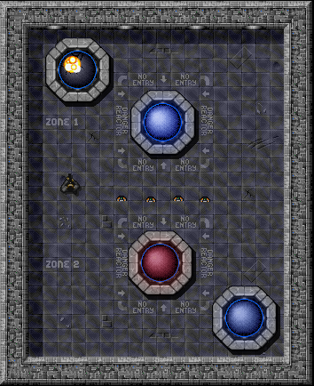
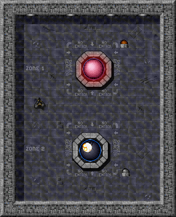

# Shutting Down Reactor

## Motivácia

## Ciele

- Osvojiť si tvorbu parametrických konštruktorov.
- Porozumieť využitiu referencie na objekt ako parametra metódy.


## Krok: Shutting Down Reactor

Výborne! Reaktor už zvládame opraviť, aj keď sa nadmieru prehreje (škoda, že v skutočnosti nestačí len to kladivo). Teraz by sa zišlo nájsť spôsob, ako reaktor v prípade potreby zastaviť alebo ho naopak naštartovať.

### Úloha
V triede reaktora vytvorte metódy `turnOn()` a `turnOff()`, pomocou ktorých bude možné reaktor zapnúť a vypnúť.

To, či je reaktor _zapnutý_ alebo _vypnutý_, reprezentuje jeho _stav_. Z minulého cvičenia už viete, ako sa reprezentuje stav objektov.

Samozrejme, reaktor môže pracovať len vtedy, keď je zapnutý. Ak nebude zapnutý, nebude možné mu zvyšovať ani znižovať teplotu pomocou jeho metód (nemali by mať efekt). Rovnako zabezpečte, aby reaktor nebol zapnutý automaticky po vytvorení jeho inštancie. Pri pokazení reaktora zabezpečte, aby bol vo vypnutom stave. Urobte potrebné úpravy, aby ste tieto skutočnosti zohľadnili.

```java
public void turnOn() {
    if (this.damage == 100) {
        return;
    }
    this.state = true;
    getAnimation().play();
    updateAnimation();
}

public void turnOff() {
    if (this.damage == 100) {
        return;
    }
    this.state = false;
    getAnimation().pause();
    updateAnimation();
}
```


### Úloha
Pre reprezentáciu reaktora vo vypnutom stave použite obrázok animácie `reactor.png`. V prípade, že sa reaktor vypne dôsledkom zničenia, zabezpečte, aby ako jeho animácia ostal nastavený obrázok `reactor_broken.png`.

Potrebný objekt animácie si pripravte v konštruktore reaktora, patrične upravte metódu nastavujúcu aktuálnu animáciu a práve vytvorené metódy `turnOn()` a `turnOff()`.


### Úloha
V triede `Reactor` vytvorte metódu `isRunning()`, ktorá zistí, či je reaktor zapnutý (vráti hodnotu _true_) alebo vypnutý (vráti hodnotu _false_).

```java
public boolean isRunning() {
    return this.state;
}
```


## Krok: Gaining Control

Ovládanie rozhorúčeného reaktora môže byť poriadne nebezpečná záležitosť. Preto sa teraz pokúsime vytvoriť diaľkový ovládač, ktorý nám umožní reaktor zapnúť alebo vypnúť bez priameho fyzického kontaktu s ním.


### Úloha
Vytvorte triedu `Controller`, ktorá bude reprezentovať ovládač pre príslušný reaktor.

Obrázok ovládača sa nachádza v súbore [sprite-link:switch]. Trieda bude mať len jednu členskú premennú nazvanú `reactor`, ktorá bude predstavovať referenciu na ovládaný reaktor. Jej hodnotu nastavte pri volaní konštruktora, ktorému bude referencia na príslušný reaktor odovzdaná v parametri.


### Úloha
Vytvorte v triede ovládača metódu `toggle()`, ktorá zapne alebo vypne ovládaný reaktor vzhľadom na jeho aktuálny stav.

Zapnutý reaktor bude volaním metódy vypnutý, a naopak.

### Úloha
Overte správnosť svojej implementácie.

Pomocou nástroja _Inšpektor_ vytvorte niekoľko inštancií reaktorov a ku každému potrebný ovládač. Overte funkčnosť ovládačov.




## Krok: Powering Light

Reaktor, ktorý ste implementovali minulý týždeň a vylepšili dnes, vyrába elektrinu. V tomto kroku vytvoríme spotrebič, ktorý ku reaktoru pripojíme. Samozrejme - bude fungovať len vtedy, ak bude reaktor vyrábať elektrinu.


### Úloha
Podľa diagramu tried vyššie vytvorte v balíku `sk.tuke.kpi.oop.game` triedu `Light`, ktorá bude reprezentovať svetlo, a otestujte svoju implementáciu.

Trieda bude mať dve metódy:

- `toggle()` - Metóda bude vedieť zmeniť stav svetla zo zapnutého na vypnuté a naopak, ako vypínač. Svetlo však bude reálne svietiť (jeho animácia bude [sprite-link:light_on]) len v tom prípade, ak bude aj napájané elektrinou.
- `setElectricityFlow()` - Metóda bude mať jeden parameter typu `boolean`, ktorý bude udávať, či je svetlu elektrina poskytovaná alebo nie.

Ako animáciu zasvieteného svetla použite súbor `light_on.png` a pre animáciu zhasnutého svetla použite súbor `light_off.png`.


> Poznámka:
> Nezabudnite, že svetlo sa má zasvietiť aj vtedy, ak je jeho vypínač prepnutý do polohy _zapnutý_ a práve ho pripojíme k dodávke elektriny!


### Úloha
V triede reaktora vytvorte metódy `addLight()` a `removeLight()`, pomocou ktorých budete vedieť k reaktoru pripojiť a odpojiť svetlo.

Aktuálny model reaktora bude vedieť súčasne napájať práve jeden spotrebič - v našom prípade to bude práve jedno svetlo. Referenciu naň dostanete prostredníctvom parametra metódy `addLight()`.

Pri volaní metód nezabudnite aktualizovať aj stav napájania spotrebiča vzhľadom na stav reaktora - ak je reaktor zapnutý a nie je pokazený, tak elektrinu vyrába. Nezabudnite rovnako aktualizovať aj všetky ostatné potrebné metódy, ktoré sa podieľajú na uvedenej zmene stavu.


### Úloha
Overte správnosť svojej implementácie vytvorením dvoch inštancií reaktorov a k nim pripojte dve inštancie svetiel.

Pri overovaní činnosti sa môžete riadiť nasledovnou pravdivostnou tabuľkou, ktorá ilustruje správanie svetla:

| isOn  | isPowered | stav svetla |
|-------|-----------|-------------|
| true  | true      | svieti      |
| true  | false     | nesvieti    |
| false | true      | nesvieti    |
| false | false     | nesvieti    |




## Doplňujúce úlohy

### Úloha
Vytvorte triedu `FireExtinguisher` pre hasiaci prístroj, ktorým bude možné uhasiť horiaci zničený reaktor.

Trieda bude potomkom triedy `AbstractActor` a bude mať členskú premennú pre počet použití, ktorej nastavte vhodnú viditeľnosť, a implementujte aj patričnú `get` metódu. Trieda nech má aj metódu `use()` na odrátavanie zostávajúceho počtu použití. Keď sa hasiaci prístroj spotrebuje, zmizne z hernej mapy. Animácia reprezentujúca hasiaci prístroj na mape je uložená v súbore [sprite-link:extinguisher].

Na uhasenie implementujte v triede `Reactor` metódu `extinguishWith()`, ktorá bude ako parameter vyžadovať objekt typu `FireExtinguisher`, ktorý sa na hasenie použije. Hasiaci prístroj vydrží jedno použitie, pri ktorom sa teplota reaktora zníži na _4000_ stupňov a animácia reaktora sa zmení na obrázok [sprite-link:reactor_extinguished]. Poškodenie reaktora sa uhasením nezmení.


## Doplňujúce zdroje

- Java Tutoriál: [What Is an Object?](http://download.oracle.com/javase/tutorial/java/concepts/object.html)
- Java Tutoriál: [What Is a Class?](http://download.oracle.com/javase/tutorial/java/concepts/class.html)
- Java Tutoriál: [What Is Inheritance?](http://docs.oracle.com/javase/tutorial/java/concepts/inheritance.html)

